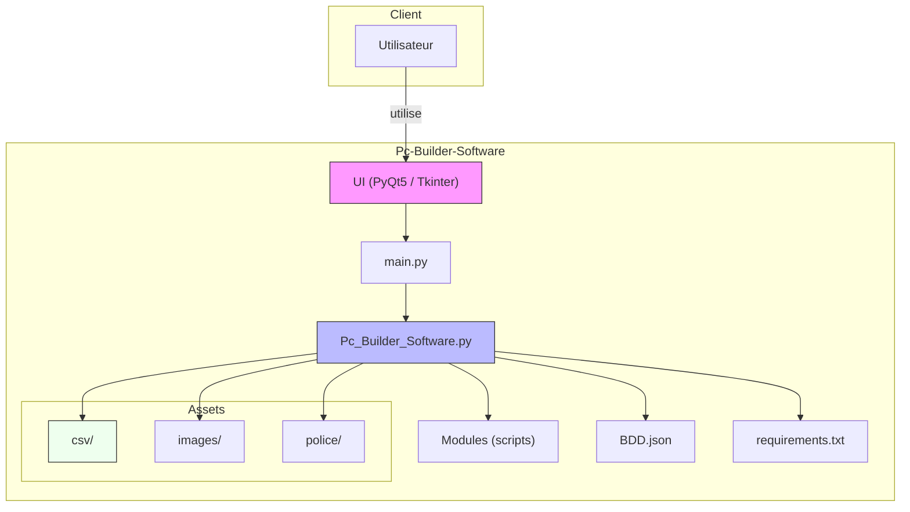

<div align="center">
	

# PC Builder Software
<i>Version initiale : 29/05/2021</i>

</div>

Un petit gestionnaire de configurations PC pour créer, modifier et sauvegarder des configurations matériel.

<div align="center">
	
</div>


## Sommaire

- [Présentation](#présentation)
- [Fonctionnalités](#fonctionnalités)
- [Diagramme d'architecture](#diagramme-darchitecture)
- [Installation & Prérequis](#installation--prérequis)
- [Utilisation](#utilisation)
- [Architecture et arborescence](#architecture-et-arborescence)
- [Crédits](#crédits)

---

## Présentation

PC Builder Software est une application Python permettant de créer, modifier, enregistrer et estimer des configurations de PC à partir de fichiers CSV (Référence venant de [UserBenchmark](https://www.userbenchmark.com/) de 2021). 
Elle fournit des écrans pour l'assistance, l'enregistrement et la modification des composants de PC.


---
## Fonctionnalités

PC Builder Software propose un ensemble d'outils pour créer, valider et sauvegarder des configurations de PC à partir de catalogues locaux. La section suivante regroupe les fonctionnalités par thèmes pour une lecture rapide.

#### Principales fonctionnalités

- **Création manuelle de configuration** : sélection visuelle de **CPU**, **GPU**, **RAM**, stockage, **carte mère**, boîtier, alimentation, **OS**, etc..
- **Modification d'une configuration** : remplacer ou ajuster des composants de votre pc actuel.
- **Chargement depuis CSV** : lecture et parcours des catalogues situés dans le dossier `csv/` (<u>CPU</u>, <u>GPU</u>, <u>RAM</u>, <u>SSD</u>, <u>HDD</u>, <u>MOTHERBOARD</u>, ...).
- **Sauvegarde & chargement** : sauvegarder la configuration au format **txt** sous le nom de "`Récapitulatif.txt`".
- **Estimation de coût** : calcul du prix total et répartition par type de composant.
- **Recherche** : recherche textuelle des composants

#### Configuration automatique et assistant

- **Auto-config** : génération automatique d'une configuration ciblée par **budget** (ex. 1000€) ou par objectif de **performance** (en se basant sur les benchmarks de UserBenchmark).
- **Assistant interactif (chatbot)** : guide pas-à-pas reposant sur la base de connaissances `BDD.json` pour répondre aux questions et orienter vers des actions (auto-config, ouverture d'un écran, modification etc...).

#### Assets et gestion des données

- **Images & polices** : contenus graphiques dans `images/` et polices dans `police/` pour personnaliser l'interface.
- **BDD.json** : base de connaissance du chatbot/assistant pour guider l'utilisateur en fonction des questions posées.
- **Chargement trop stylé** : Faux loading de l'interface graphique avec PyQt5

---

## Diagramme d'architecture

Voici un diagramme Mermaid décrivant l'architecture générale du projet :



Ce diagramme montre le flux général : l'utilisateur interagit avec l'UI, les scripts principaux orchestrent le chargement CSV, l'accès aux assets et la BDD du chatbot.

## Architecture et arborescence

Arborescence explicite du dépôt :

```text
Pc-Builder-Software/
├─ main.py                  # point d'entrée
├─ Pc_Builder_Software.py   # logique principale
├─ BDD.json                 # base de connaissance du chatbot (Q&A, redirections)
├─ requirements.txt         # dépendances du projet
├─ chargement.py            # utilitaires de chargement
├─ infos_csv.py             # lecture/gestion des CSV
├─ infos_pc.py              # manipulation des configurations PC
├─ csv/
│  ├─ CPU.csv
│  ├─ GPU.csv
│  ├─ RAM.csv
│  ├─ SSD.csv
│  ├─ HDD.csv
│  └─ MOTHERBOARD.csv
├─ images/
│  ├─ *.png
├─ police/
│  ├─ *.ttf
└─ README.md
```

## Installation & Prérequis

- Python 3.8+ (testé sur Windows 10)
- Créer un environnement virtuel (recommandé) :

```batch
python -m venv .venv; .\.venv\Scripts\Activate.ps1
```

## Installation

1. Cloner le dépôt
```batch
git clone https://github.com/MatisAgr/Pc-Builder-Software
```

2. Installer les polices du dossier `police/` sur votre système si vous voulez l'apparence attendue.

3. Installer les dépendances avec `requirements.txt` :
```batch
pip install -r requirements.txt
```


## Utilisation

1. Placer votre terminal dans le dossier du projet :

```batch
cd "c:\Users\matis\Desktop\Ceci est un dossier SSD\git\Pc-Builder-Software"
```

2. Lancer l'application :

```batch
python main.py
```


### À propos de `BDD.json`

> [!NOTE]
> Le fichier `BDD.json` est utilisé par l'assistant intégré (chatbot) de l'application. Il contient des paires question/réponse et des règles de redirections internes qui permettent :
>
> - de guider l'utilisateur via des questions interactives (assistant pas-à-pas),
> - d'orienter vers des écrans de configuration ou des presets selon les réponses,
> - de stocker des scénarios de dialogue et des réponses prêtes à l'emploi pour l'assistant.
> Cette BDD JSON n'est pas la base de données des configurations PC (qui sont stockées séparément) mais la base de connaissance du chatbot/assistant.

## Crédits

- Pierre-Louis - Julien - Marius - Matis
